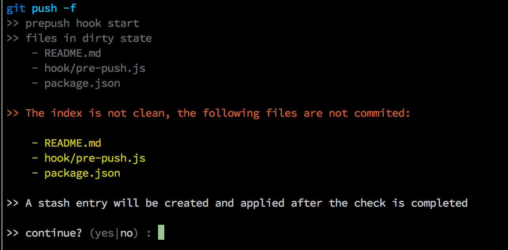

[](https://npmjs.org/package/prepush)
[](https://travis-ci.org/royriojas/prepush)

# prepush
> Yet another prepush module that will run tasks defined in a config file or in a package.json file, stashing anything that is not supposed to be pushed before run the scripts to avoid false positives

## Motivation

All the other modules similar to this one were specifying the prepush tasks in the `package.json` file. While this is ok
I needed to have it defined in a separated config file. Also I needed to have the option to interactively ask the user
to decide what to do in case a push was done with a dirty state (*uncommited*/*untracked* files)



**You might also like**: [precommit](https://npmjs.org/package/precommit). A module to install a script for the `pre-commit` git hook inspired by this module, and [changelogx](https://npmjs.org/package/changelogx) which also provide a script for the
`commit-msg` git hook.

## Install

```bash
# install it as a dev-dependency.
npm i --save-dev prepush

# install the hook, passing the path to the config. If none is provided it will try to use the `package.json`
./node_modules/prepush/bin/cli.js install -c ./path/to/your/config
```

Using a custom prepush.json

```javascript
{
  "prepush" : [ "npm test" ]
}
```

or in your package.json file

```javascript
{
  "prepush" : [ "grunt prepush" ]
}
```

or as an object in a `custom.json` file or in `package.json` add the following section

```javascript
{
  "prepush": {
    // the tasks to run
    "tasks": [ "grunt prepush" ],
    // What to do in case of a dirty state
    // ask   => Show a prompt to the user to decide what to do, stash or fail.
    // fail  => Simply refuse to push something when you have uncommited/untracked files
    // stash => If there are uncommited/untracked files stash them, do the push and restore the stash
    //          This will also move untracked files into the stash
    "onDirtyState": "ask", // <== fail or stash,
    "coloredOuput": true, // <== true or false. If ommited it will try to use the env variable `__CLIX_COLORED_OUTPUT__` (from `clix` module)
    "ignoreBranch": ["test", "test2"], // <== string or array of strings: the branches the hook should not run on
    "applyToBranch": ["master", "development"] // <== string or array of strings: the branches the hook should protect
    // note that ignoreBranch is applied before applyToBranch, so a branch with its name in both will be ignored by the hook
  }
}
```

**Important**
Be aware that if you cancel the program using `CTRL+C` then the stash might not be restored.
So you will have to restore it manually. TODO: trap the `SIGINT` event and restore the
stash transparently for the user.

## cli usage

The following are the options available on the cli command that install/remove the hook. To pass options to the hook. Please use the `prepush` section on your config file or in the `package.json` file.

```
Yet another `prepush` module that will run tasks defined in a config file or in a package.json file, stashing anything that is not supposed to be pushed before run the scripts to avoid false positives!

========================================================
Usage: prepush -c [path/to/config/file] [install|remove]
========================================================

  -h, --help           Show this help
  -v, --version        Outputs the version number
  -q, --quiet          Show only the summary info - default: false
  --colored-output     Use colored output in logs
  -c, --config String  Path to your `prepush` config, if not provided will try to use the `package.json` file in your current working directory, expecting an
                       entry called `prepush`
```

**Note**: The `colored-output` in the cli is only for logs during installing/removing the hook.

If you want to enable the colored logs in the actual prepush hook, please include the option
`coloredOutput` in your `prepush` section. Like this:

```javascript
{
  "prepush": {
    // the tasks to run
    "tasks" : [ "grunt prepush" ],
    "onDirtyState": "ask",
    "coloredOuput" : true // or false
  }
}
```

The hook also honor the clix env variable to enable colored output `__CLIX_COLORED_OUTPUT__` so if you set this variable in your environment you don't need to configure it in the `prepush` section.

## Example

```bash
# install the hook and use the package.json prepush field
./node_modules/prepush/bin/cli.js install

# install the hook using a custom prepush.json file
./node_modules/prepush/bin/cli.js install -c ./path/to/prepush.json

# remove the hook
./node_modules/prepush/bin/cli.js remove
```

## Usage in npm scripts

```javascript
// in the scripts field
{
  "scripts": {
    "hook-install": "prepush install",
    "hook-remove": "prepush remove",
    "prepush" : "eslinter 'src/**/*.js'" // put here any script you want to run
  },
  "prepush" : {
    "tasks" : ["npm run prepush"]
  }
}
```

then in the command line you can do:

```bash
# install
npm run hook-install

# remove
npm run hook-remove
```

## License

[MIT](./LICENSE)

## Changelog
[Changelog](./changelog.md)
